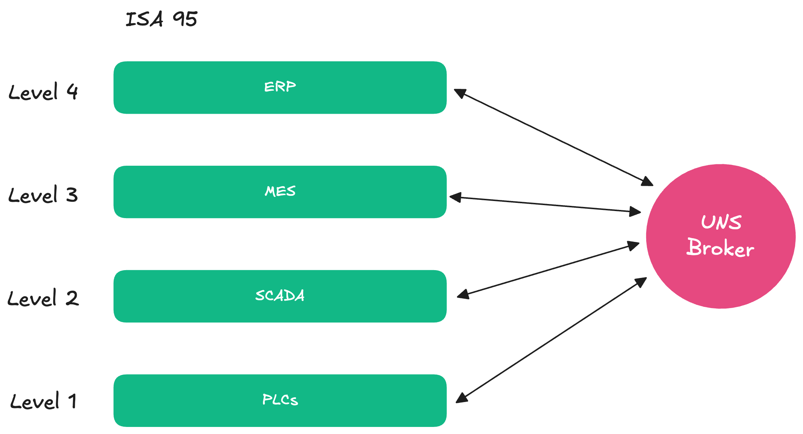

<h1 align="center">Vehcr - SaaS for Manufacturing.</h1>

<p align="center">
  <a href="" target="blank"></a>
  <br>
  <i>Vehcr is platfom SaaS to help productivity in manufacturing through Technology
    <br> Running in Kubernetes Engine, it can be cloud or on premises.</i>
  <br>
</p>


<p align="center">
  <a href="https://github.com/vechr/vechr-atlas/issues">Submit an Issue</a>
  <br>
  <br>
</p>


<p align="center">
  <a href="https://artifacthub.io/packages/helm/vechr/vechr-iiot">
    
  </a>
</p>


Vechr (Manufacturing Execution System). This is Under [Vechr](LICENSE).

# Importance Concepts
The concep of this application is use UNS (Unified Namespace) as big node of the data. 

## Unified Namespace IIoT

<p align="center">
  <a href="" target="blank"></a>
</p>

Unified Namespace is an extended event-driven architecture, in which all data gets published regardless of whether there is an actual consumer or not. We leverages MQTT/NATS as a central message broker.

## ISA-95

<p align="center">
  <a href="" target="blank"></a>
</p>

If we compare with ISA-95, the data will flow from the Bottom (PLC) to the until Upper (Cloud), this is industry 3.0, In Industry 3.0 setups the general dataflow would be somewhat linear and would only flow in one direction: From the sensors to the PLC to SCADA and MES to the ERP. With a unified this would be much more connected, so if we compare with UNS, (ERP, SCADA, etc) we can say **node** and node will publish and consume the data from UNS system, so this will achieve integration more easy.

# Architecture Diagram

<p align="center">
  <a href="" target="blank"></a>
</p>

## Setup Application (Development)
Before pulling you'll need to all **access** for submodule repository.

### 1. Import Certificate
Download or Import [root certificate](./certificate/self-signed/rootCA.pem) or you can generate by your self, be aware that you need to create for  [./certificate/self-signed/ingress](./certificate/self-signed/ingress) and [./certificate/self-signed/nats](./certificate/self-signed/nats) as well. Import in our browser or OS so we will have secure connection https

If you don't now how to generate your own certificate, you can try to follow this [tutorial](./certificate/self-signed/README.md)

Here are some article how to import the certificate: </br>
[In MAC](https://support.apple.com/en-in/guide/keychain-access/kyca2431/mac)</br>
[In Chrome](https://docs.vmware.com/en/VMware-Adapter-for-SAP-Landscape-Management/2.1.0/Installation-and-Administration-Guide-for-VLA-Administrators/GUID-D60F08AD-6E54-4959-A272-458D08B8B038.html)

### 2. Pull repository
```
git clone --recursive https://github.com/vechr/vechr-iiot.git
```

Edit `.env` file, configure `APP_LISTS`, this line will decided what are the list of container that you'll run.
```
APP_LISTS=api-gateway,redis,grafana,tempo,loki,promtail,prometheus,notification-service,mail-dev,web-app,postgres-db,pg-admin4,things-service,auth-service,db-logger-service,influxdb,nats-server,mosquitto,nats-box
```

### 3. Configured `.env` in each application
You need to setup the .env variable file, and see in each application have `.env.example`
1. `application/web-app/.env` <== See `application/web-app/.env.example`
2. `microservices/auth-service/.env` <== See `microservices/auth-service/.env.example`
3. `microservices/db-logger-service/.env` <== See `microservices/db-logger-service/.env.example`
4. `microservices/notification-service/.env` <== See `microservices/notification-service/.env.example`
5. `microservices/things-service/.env` <== See `microservices/things-service/.env.example`
6. `.env` <== `.env.example`
### 4. Allowing Script
Script must be have an access before executing
```
chmod 777 scripts/
chmod 777 ./dockerfiles/database/postgres/create-multiple-db.sh
```

### 5. Running Application

Running all container
```bash
./up.sh
```

### 6. Test the connection
Try to ping the connection, if cannot be access, you need to settings the hosts files
```bash
ping app.vechr.com
ping nats.vechr.com
```

In MAC or Linux, and set `/etc/hosts`, if your environment windows setting in `C:\Windows\System32\drivers\etc\hosts`
```h
127.0.0.1 app.vechr.com
127.0.0.1 nats.vechr.com
```

### 7. Access the Application
You can try to access the application, you can visit the app in here `https://app.vechr.com`

## Administrative Matters
### 1. Starting All Container
```bash
./up.sh
```
### 2. Stoping All Container
```bash
./down.sh
```

### 3. Logs container
```bash
#example
./logs.sh influxdb
```

### 4. SSH to container
```bash
#example
./ssh.sh nats-box
```

## Testing NATS with MQTT (Start Publish Subscribe)
Open 4 terminal, and run each command below

### 1. Subscribe to MQTT topic on Terminal 1
This command will listen on topic `NATS/MQTT/Test/#` mqtt
```bash
# ssh to container
./ssh.sh "mosquitto"
# Subscribe message
/scripts/mqtt-sub.sh
# or using this instead mqtt-sub.sh
mosquitto_sub -h nats-server -p 1883 -t "NATS/MQTT/Test/#"
```

### 2. Subcribe to NATS Subject on Terminal 2
This command will listen on subject `NATS.MQTT.Test/>` nats
```bash
# ssh to container
./ssh.sh "nats-box"
# Subscribe message
nats -s nats://nats-server sub "NATS.MQTT.Test.>"
```

### 3. Publish to NATS subject on Terminal 3
You can execute this command several time
```bash
# ssh to container
./ssh.sh "nats-box"
# Publish message
nats -s nats://nats-server pub "NATS.MQTT.Test.>" "This is message from nats"
```

### 4. Publish to MQTT topic on Terminal 4
You can execute this script several time
```bash
# ssh to container
./ssh.sh "mosquitto"
# Publish message
/scripts/mqtt-pub.sh
#or using this instead mqtt-pub.sh
mosquitto_pub -h nats-server -p 1883 -t "NATS/MQTT/Test/" -m "This is message from mqtt"
```


### 5. Publish MQTT Data
Please use this topic format to store in database
`Vechr/DashboardID/<Your Dashboard ID>/DeviceID/<Your Device ID>/topic/<Your Topic Name>`
```bash
mosquitto_pub -h nats-server -p 1883 -t "Vechr/DashboardID/87jk234/DeviceID/9jk2b2189/topic/temp" -m "80.23"
```

## Use dummy Infinite Loop Send message to NATS
```bash
while true; do nats pub -s nats://nats.vechr.com:4222 Vechr.DashboardID.04916c8e-0ff5-4a18-943a-bf5e428035c2.DeviceID.c1e241db-3d93-4eb5-a58d-c6b2a57c9ae3.TopicID.bde3bd17-dd97-46b2-990f-eca2fc80f356.Topic.oee.availability $(($RANDOM%(100-80+1)+80)) && sleep 0.5; done
```